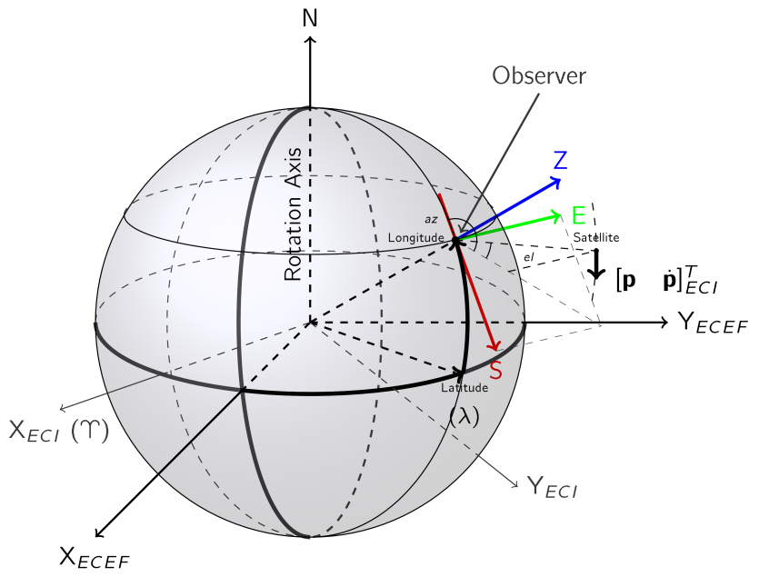
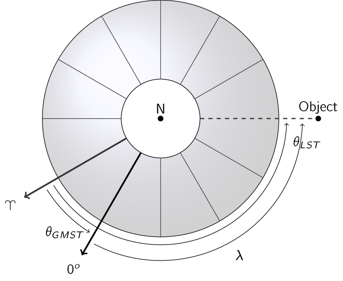
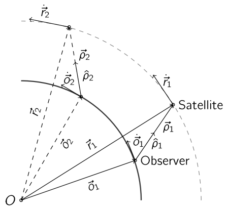
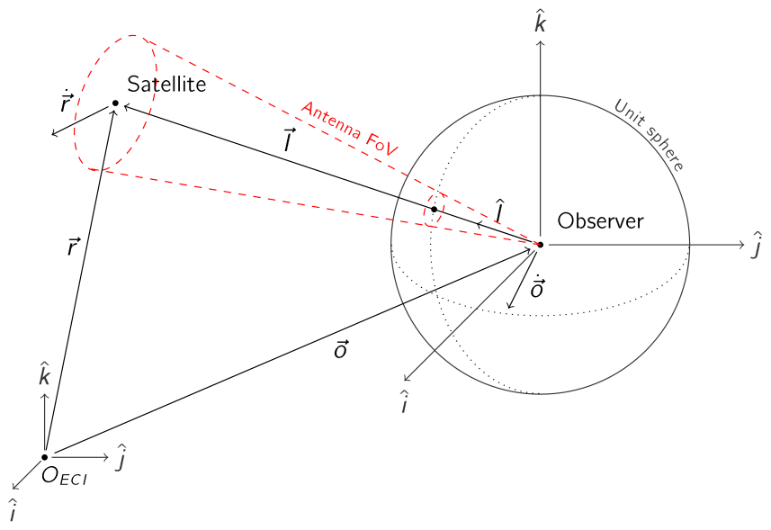
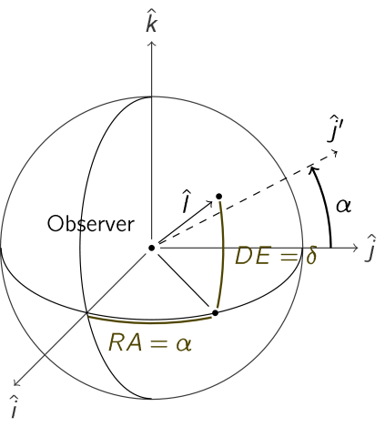
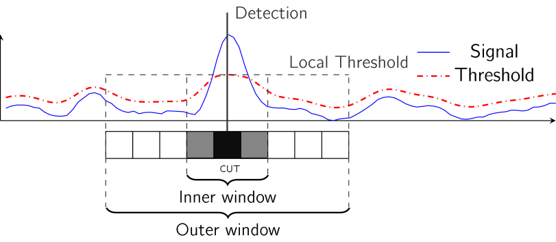

# Aerospace

## Coordinate Systems

### Topocentric Range, Azimuth, Elevation (RAZEL), Earth-Centered Inertial (ECI), Eart-Centered, Earth-Fixed (ECEF)

The Topocentric Horizon (SEZ) system is a common coordinate system used for observers located on the surface of the Earth. The Cartesian frame is formed from the South-East plane tangent to the Earth surface in the point of the observer's location and Z axis pointing towards zenith. The radar data is usually represented in angles (azimuth, elevation) and range to the target. The World Geodetic System 1984 (WGS 84) is a ECEF global reference system and geodetic datum. It is also used as a reference system in the Global Positioning System (GPS). In comparison with ECEF frame, which is anchored to the Earth, the x-axis of the ECI frame lies in the direction of the vernal equinox (♈︎). 

### Topocentric Range, Azimuth, Elevation (RAZEL) -> Earth-Centered Inertial (ECI)

## Observations

### Doppler / Range Rate Observables Geometry

 

### Topocentric Right Ascension, Declination

## Miscellaneous

### Constant False Alarm Rate (CFAR)

