# Architectures

## [AlexNet](https://papers.nips.cc/paper/4824-imagenet-classification-with-deep-convolutional-neural-networks.pdf)

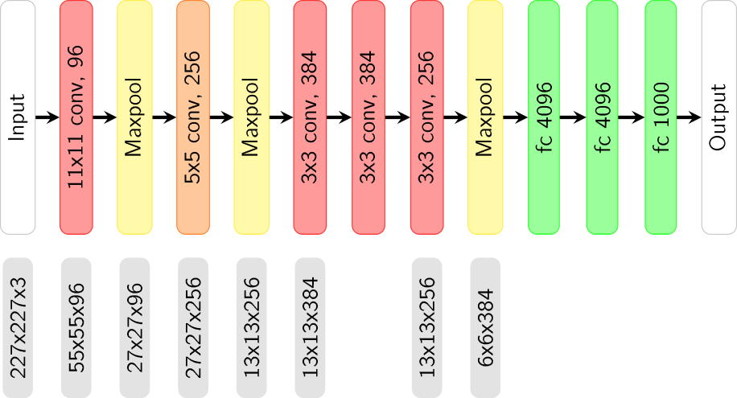

## [VGG16](https://arxiv.org/pdf/1409.1556.pdf)

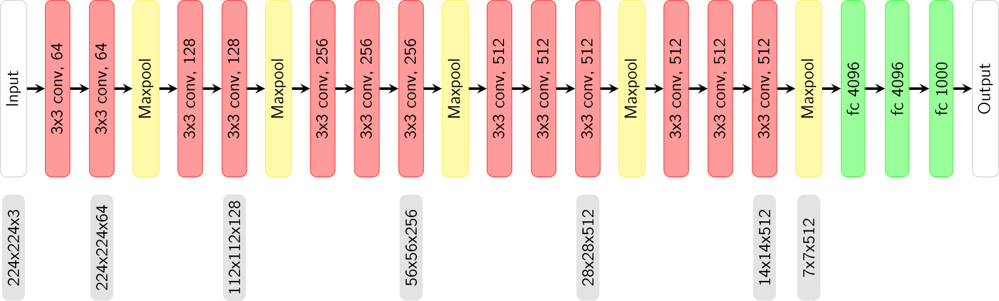

## VGG16 vs. VGG 19

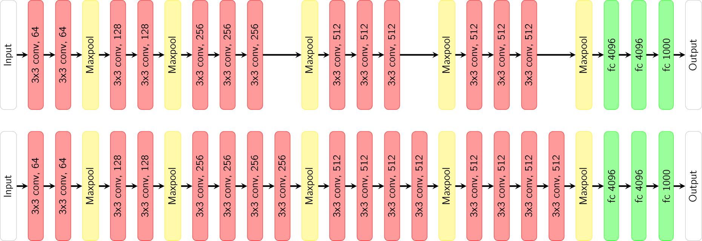

## [ResNet18](https://arxiv.org/pdf/1512.03385.pdf)

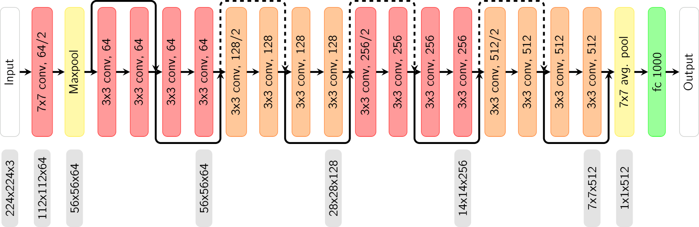

## [Inception-v1](https://arxiv.org/pdf/1409.4842.pdf)

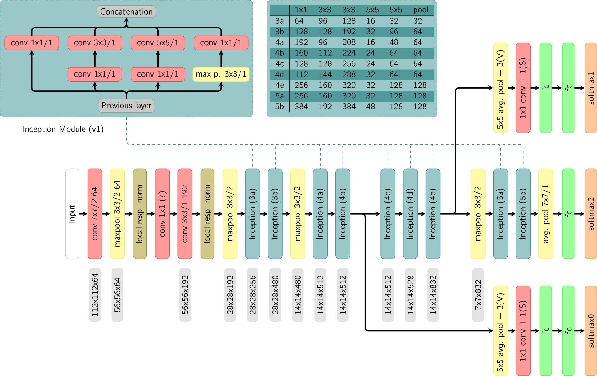

## [Fast and Furious](http://openaccess.thecvf.com/content_cvpr_2018/papers/Luo_Fast_and_Furious_CVPR_2018_paper.pdf)

### Early Fusion

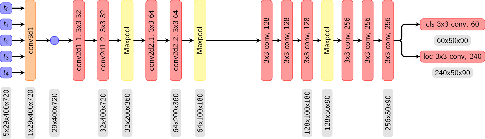

### Late Fusion

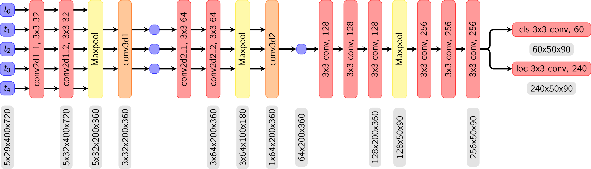

# Computation Graph Example
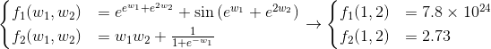
  
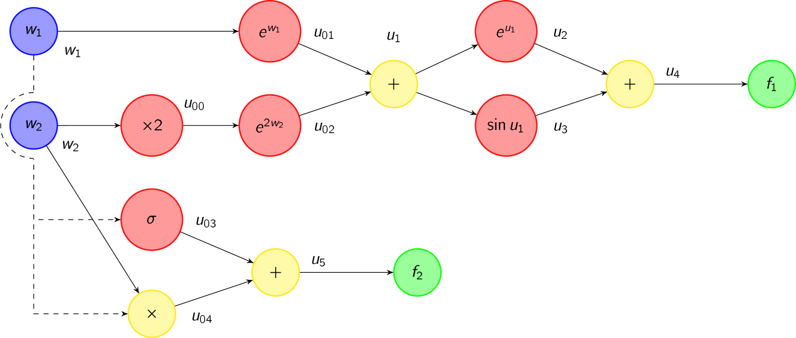
  
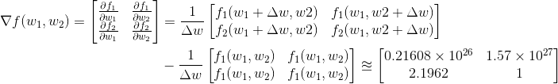
  
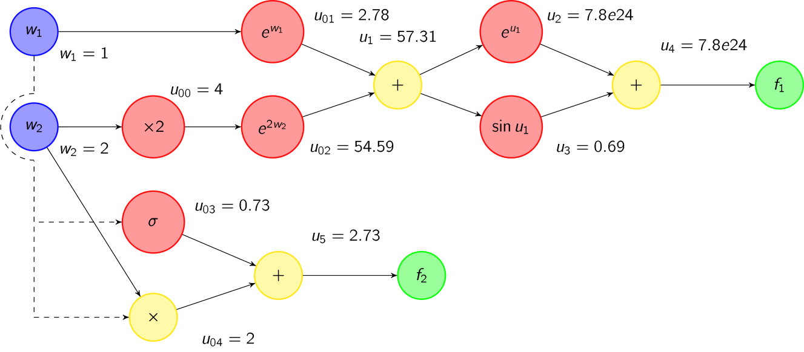
  
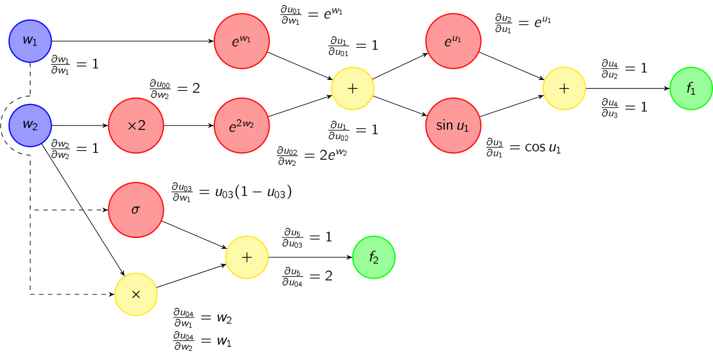

## Forward Mode Automatic Differentiation

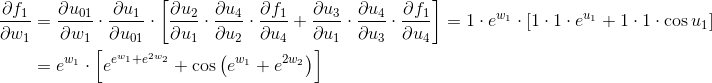
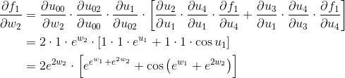
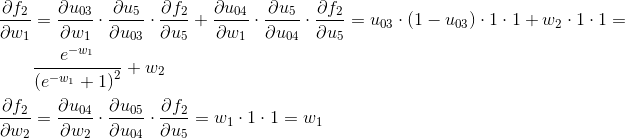

## Reverse Mode Automatic Differentiation

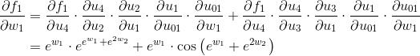
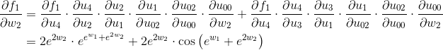 
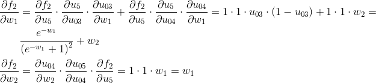